# Security Algorithm Hand-On
Tutorial about security algorithm like DES, AES, MD5 use java form 

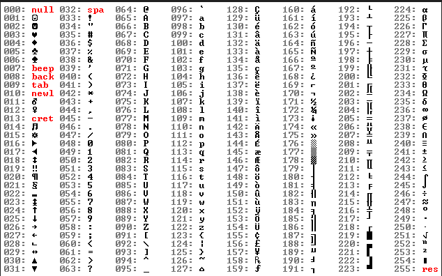

## Outline

1. Classical Symmetric encryption Algorithm
2. Modern Symmetric encryption Algorithm
3. RSA public key
4. Key management using public encryption
5. Hash Algorithm
6. Test 
6. Refer
6. Author

Click here to download [Set up file!!!](https://drive.google.com/file/d/1tEAwrylGUOWDb523krr_-NkLcvx9gVBj/view?usp=sharing)

- The refer code use 
  - Netbean IDE 8.2
  - JDK 1.8

## Classical Symmetric encryption Algorithm

### Ceasar

| What's Ceasar? | Result                                                       |
| -------------- | ------------------------------------------------------------ |
|                | 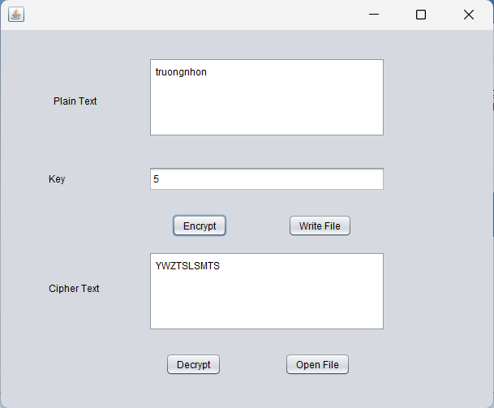 |

### Vigenere

|      | Result                                                       |
| ---- | ------------------------------------------------------------ |
|      | 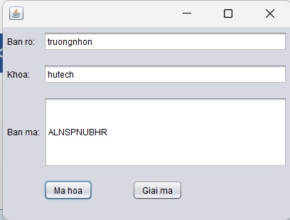 |

### Rail Fence

|      | Result                                                       |
| ---- | ------------------------------------------------------------ |
|      | 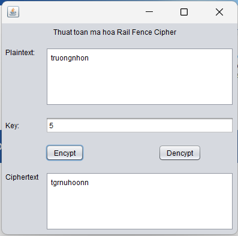 |

### Play fair ??

## Modern Symmetric encryption Algorithm

### DES

|      |                                                              |
| ---- | ------------------------------------------------------------ |
|      | 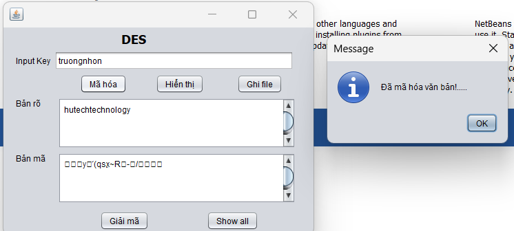 |

### Triple DES

|      |                                                              |
| ---- | ------------------------------------------------------------ |
|      | 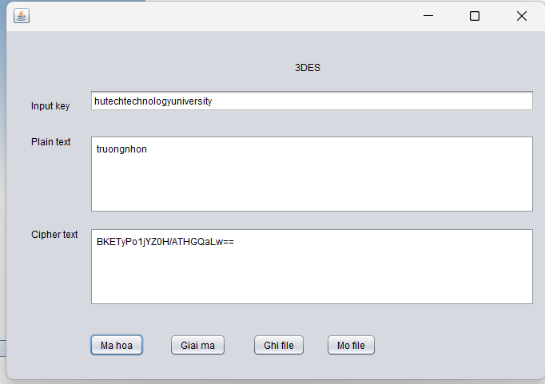 |

### AES

|      |                                                              |
| ---- | ------------------------------------------------------------ |
|      | 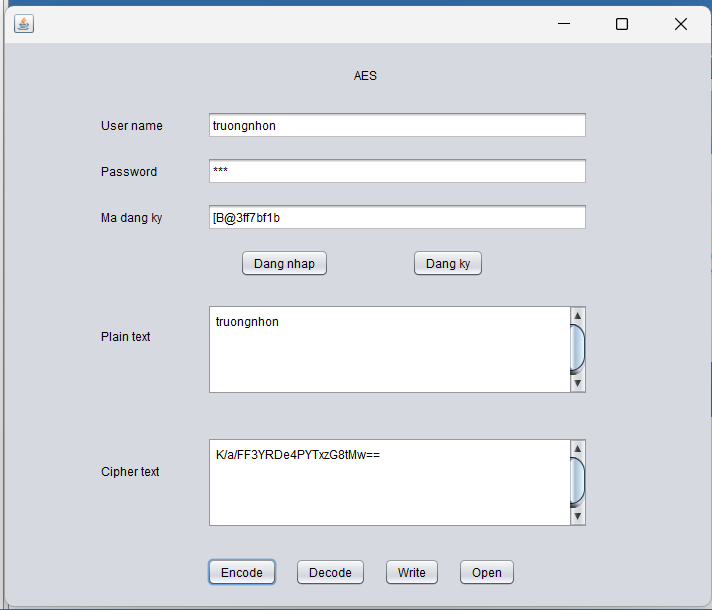 |

## Encrypt public key

### RSA

|      |                                                              |
| ---- | ------------------------------------------------------------ |
|      | 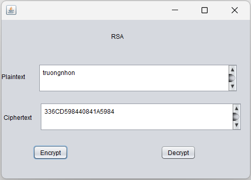 |

## Key management using public encryption

### Exchange key DIFFIE-HELLMAN

| Form bob                                                     | Form alice                                                   | Form encrypt                                                 |
| ------------------------------------------------------------ | ------------------------------------------------------------ | ------------------------------------------------------------ |
| 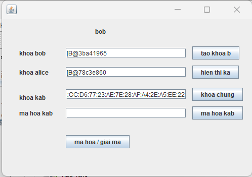 | 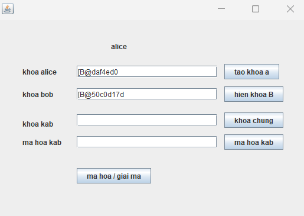 | 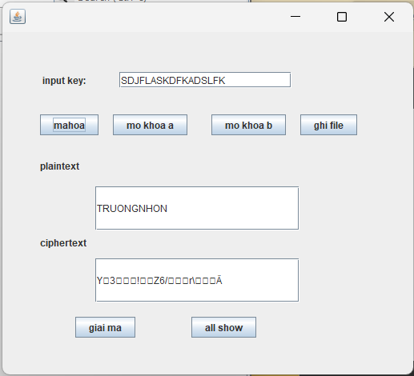 |

## Hash Algorithm

### MD5

| Sign up feature                                              | Log in feature                                               |
| ------------------------------------------------------------ | ------------------------------------------------------------ |
| 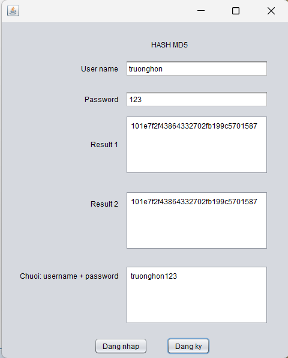 | 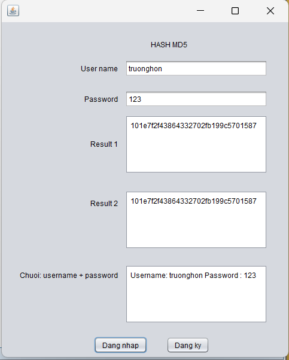 |

### SHA

|      |                                                              |
| ---- | ------------------------------------------------------------ |
|      | 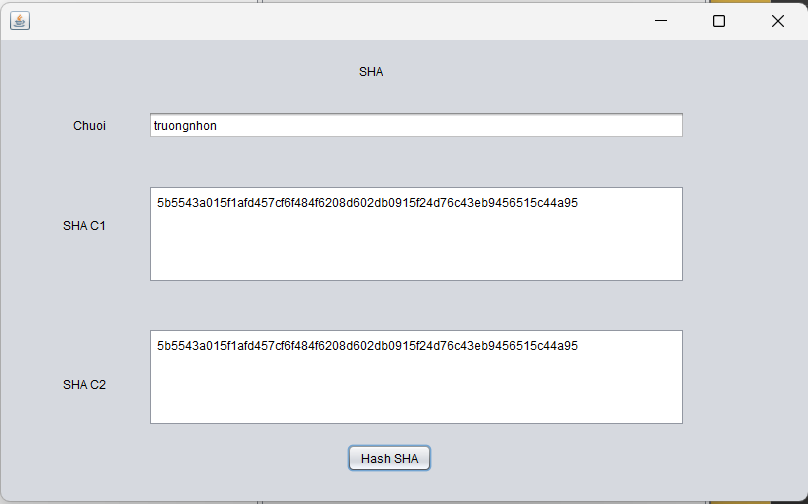 |

### MD5 and Sign

|                                                              |                                                              |
| ------------------------------------------------------------ | ------------------------------------------------------------ |
| 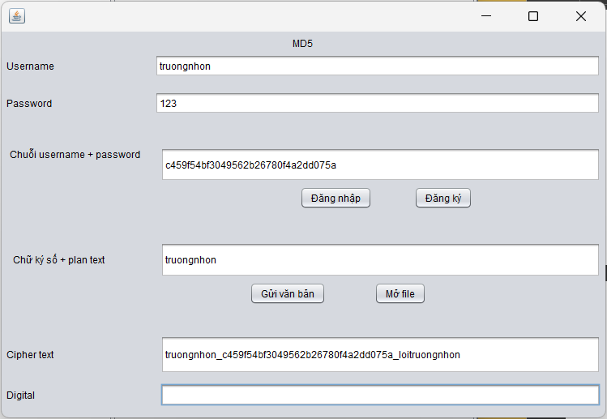 | 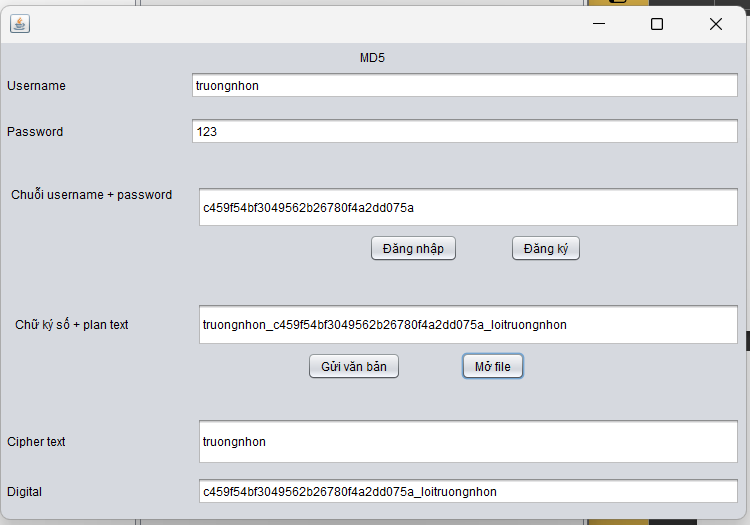 |

## Reference

- Hutech document
- ...

## Author

- Võ Thương Trường Nhơn
- Any question?? Contact vothuongtruongnhon2002@gmail.com
